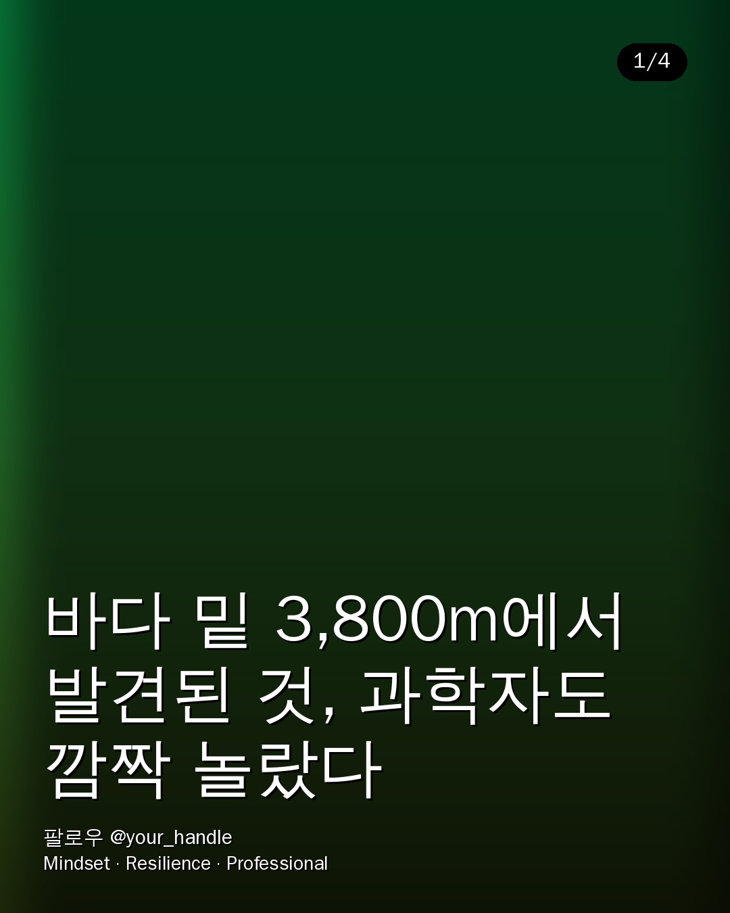
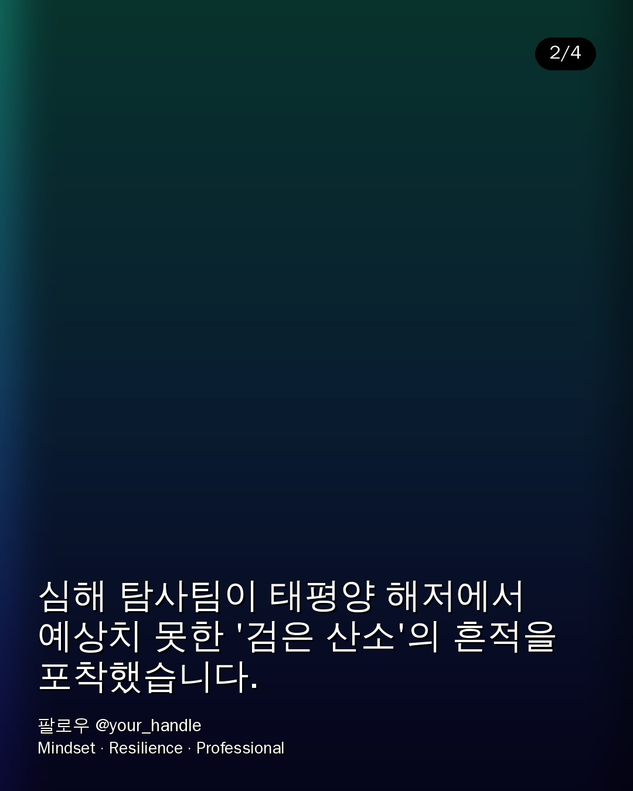

# newsroom — 해외 뉴스 → 텔레그램 검토 → 인스타 카드뉴스/릴스 자동 발행

해외 뉴스 RSS를 매일 수집하고, AI가 콘텐츠로 만들기 좋은 후보를 1차 선별해
**텔레그램으로 검토 요청**을 보냅니다. 내가 '발행' 버튼을 누르면 그때부터
**카드뉴스 + AI 릴스**를 자동 생성해 **인스타그램에 업로드**합니다.

```
STEP 1  수집 + AI 1차 선별            RSS → Claude 선별
STEP 2  텔레그램 검토 (Human-in-Loop)  후보 N건 전송 → [✅ 발행] 버튼
STEP 3  콘텐츠 자동 생성               원고(Claude) → 이미지(Gemini/Grok) → 카드(Pillow)
                                     + 릴스(힉스필드 + TTS + BGM, FFmpeg 합성)
STEP 4  인스타그램 자동 업로드          Graph API (캐러셀 + 릴스)
```

기술 선택 근거(이미지 API·영상 병합 스택·카드 템플릿)는 **[RECOMMENDATIONS.md](RECOMMENDATIONS.md)** 참고.

## 카드뉴스 템플릿 미리보기

`docs/samples/` (배경은 데모용 그라데이션, 실제로는 AI 생성 이미지가 들어갑니다)

| 표지 | 본문 |
|---|---|
|  |  |

---

## 설치

```bash
cd newsroom
python -m venv .venv && source .venv/bin/activate
pip install -r requirements.txt          # Pillow / anthropic / feedparser / requests / PyYAML
# 릴스 합성용 시스템 바이너리
sudo apt-get install -y ffmpeg           # macOS: brew install ffmpeg

cp .env.example .env                      # 키 채우기 (아래 표)
```

### 필요한 키 (.env)

| 용도 | 변수 | 없으면 |
|---|---|---|
| AI 선별/작가 | `ANTHROPIC_API_KEY` | 필수 |
| 이미지 생성 | `GOOGLE_API_KEY`(Gemini) 또는 `XAI_API_KEY`(Grok) | 그라데이션 배경으로 폴백 |
| 텔레그램 검토 | `TELEGRAM_BOT_TOKEN`, `TELEGRAM_CHAT_ID` | 검토 단계 사용 시 필수 |
| 릴스 영상 | `HIGGSFIELD_API_KEY` | 릴스 생략(카드뉴스만) |
| 나레이션 | `ELEVENLABS_API_KEY` 또는 Google | 무음/생략 |
| 인스타 업로드 | `IG_USER_ID`, `IG_ACCESS_TOKEN`, `PUBLIC_ASSET_BASE_URL` | 업로드 생략(파일만 생성) |

> 키가 없는 단계는 자동으로 **dry-run**(생략/폴백)되어 파이프라인이 멈추지 않습니다. 하나씩 채워가며 테스트할 수 있습니다.

---

## 실행

```bash
# 0) 키 없이 카드 템플릿부터 확인
python demo_cards.py                # docs/samples/*.png 재생성

# 1) 선별 결과만 콘솔로 확인 (ANTHROPIC_API_KEY 필요)
python run_ai.py --dry

# 1-b) 발행 직전까지 로컬 테스트: 수집→선별→원고→이미지→카드/릴스 파일 생성 (텔레그램/인스타 없이)
python run_ai.py --generate            # out/ 에 결과물 생성, 인스타 발행은 안 함
# python run_ai.py --generate --publish  # 인스타 발행까지 진행

# 2) 매일 실행: 수집 → 선별 → 텔레그램 검토 요청  (크론에 등록)
python run_ai.py

# 3) 승인 데몬: '발행' 버튼을 받아 생성/업로드 (상시 실행)
python run_ai_bot.py
#   ↳ 처음엔 봇에게 아무 메시지나 보내면 콘솔에 chat_id 가 찍힘 → .env 에 입력
```

크론/서비스 등록 예시는 [`cron/crontab.example`](cron/crontab.example).

---

## 구조

```
newsroom/
├─ run_ai.py            # 매일: 수집→선별→텔레그램
├─ run_ai_bot.py        # 상시: 승인 데몬(버튼→생성/발행)
├─ demo_cards.py        # 키 없이 카드 템플릿 데모
├─ config/ai.yaml       # 소스/필터/브랜드/템플릿/릴스 설정 (비밀값 제외)
├─ .env.example         # 비밀값 템플릿
├─ RECOMMENDATIONS.md   # 기술 검토 답변(이미지 API·영상 병합·템플릿)
└─ newsroom/
   ├─ config.py         # ai.yaml + .env 로드
   ├─ models.py         # Article / Candidate / ContentPlan / Bundle
   ├─ store.py          # 승인 상태 JSON 저장
   ├─ collector.py      # STEP1 RSS 수집
   ├─ ai.py / ai_filter.py / ai_writer.py   # STEP1 선별 · STEP3 원고 (Claude)
   ├─ telegram_bot.py   # STEP2 검토(인라인 키보드) + 승인 폴링
   ├─ image_gen.py      # STEP3 이미지 (gemini | grok)
   ├─ cardnews.py       # STEP3 카드 렌더 (Pillow, 5번째 사진 템플릿)
   ├─ tts.py / reels.py # STEP3 릴스 (TTS + 힉스필드 + FFmpeg 합성)
   ├─ instagram.py      # STEP4 Graph API 업로드
   └─ pipeline.py       # 전체 오케스트레이션
```

## 참고/주의
- **인스타 Graph API 는 공개 URL 을 요구**합니다. 완성된 카드/릴스를 S3/R2/GCS 등에 올려
  `PUBLIC_ASSET_BASE_URL` 로 접근 가능하게 한 뒤 업로드됩니다.
- 힉스필드/일부 TTS는 계정·버전에 따라 엔드포인트/필드가 다를 수 있어, 해당 클라이언트에
  교체 지점을 주석으로 표시해 두었습니다.
- 저작권 무관 배경음악은 `assets/music/` 에 mood별(`calm/upbeat/dramatic/curious`)로 넣어두세요.
