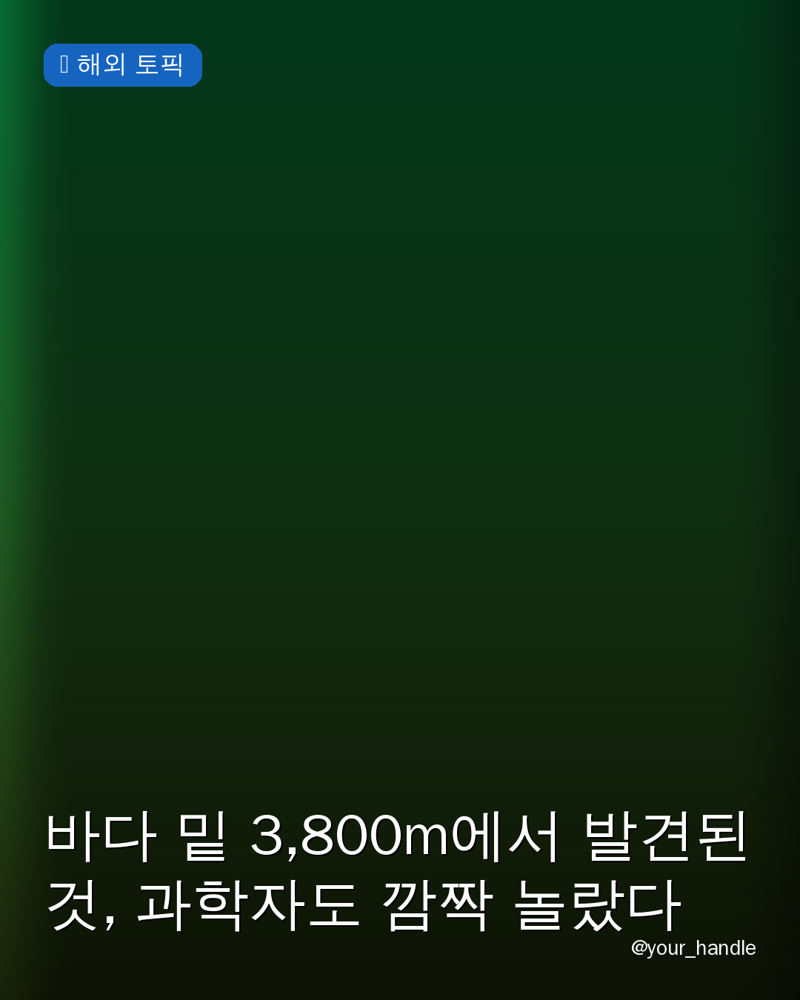
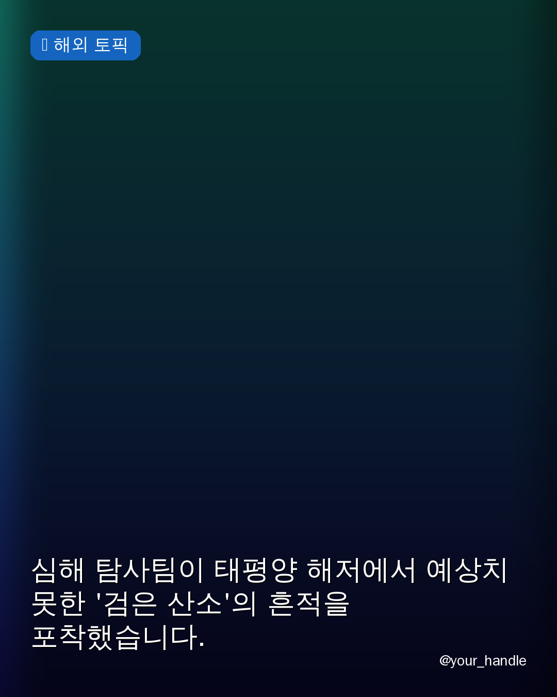

# 기술 검토 및 추천 (요청 3가지)

> 요청하신 세 가지 기술 검토 사항에 대한 답변입니다. 결론 → 근거 → 실제 코드 반영 순서로 정리했습니다.

---

## 1. 카드뉴스 이미지 생성 API: Grok vs. 구글(Gemini)

### 결론 — **구글 Gemini(Imagen) 를 권장합니다.** (`config/ai.yaml`의 `image.provider: gemini`)

파이프라인 연동 편의성과 안정성 두 축 모두에서 Gemini 계열이 우세합니다. 다만 구조는 **provider 추상화**(`newsroom/image_gen.py`)로 짜 두어, Grok 구독을 계속 쓰고 싶으면 설정 한 줄(`image.provider: grok`)로 전환됩니다.

### 비교

| 항목 | 구글 Gemini / Imagen | Grok (xAI) |
|---|---|---|
| **연동 편의성** | 공식 파이썬 SDK(`google-genai`)로 이미지 생성·저장이 몇 줄. `aspect_ratio`(4:5, 9:16 등)를 파라미터로 직접 지정 → **카드/릴스 비율에 딱 맞게** 바로 생성 | OpenAI-호환 `images/generations` 엔드포인트를 `requests` 로 호출. 동작은 하지만 **비율 지정이 제한적**이라 후처리(crop) 의존 |
| **안정성/일관성** | 스타일·구도 재현성이 좋고, 실패율이 낮음. 대량 자동 발행에 유리 | 이미지 모델이 텍스트/코딩 대비 상대적으로 신생. 스타일 일관성 편차 |
| **콘텐츠 안전성** | SynthID 워터마킹·세이프티 필터 내장 → 자동 발행 리스크↓ | 필터 정책이 상대적으로 느슨 → 자동 발행 시 검수 부담↑ |
| **비용/구독** | 종량제(Imagen). GOOGLE_API_KEY 하나로 이미지+TTS(Cloud TTS)까지 재사용 가능 | 이미 구독 중이라 한계비용 0에 가까움 (이 점만은 Grok 유리) |
| **카드뉴스 적합성** | "텍스트 없는 배경 사진" 프롬프트 준수도가 높음 → 우리 템플릿(글자는 코드로 얹음)과 궁합 | 준수도 편차 있어 배경에 글자가 섞여 나올 때가 있음 |

### 실무 권장
- **1차 권장: Gemini(Imagen)** — 자동 발행 파이프라인의 안정성과 비율 제어가 핵심이라서.
- **비용 최적화가 우선이면**: 이미 구독 중인 Grok 을 배경 생성에 쓰고, 텔레그램 검수 단계에서 사람이 한 번 거르는 현재 구조(Human-in-the-Loop)로 리스크를 보완하는 것도 합리적입니다.
- 코드가 이미 추상화되어 있으니 **A/B로 며칠 돌려보고** 결과물 퀄리티로 최종 결정하시길 권합니다.

> 구현: `newsroom/image_gen.py` — `_gemini()` / `_grok()` 두 백엔드. 키가 없으면 자동으로 그라데이션 배경으로 폴백하여 파이프라인이 멈추지 않습니다.

---

## 2. 비디오/오디오 병합 파이프라인 (딜레이 없는 렌더링/병합 스택)

### 결론 — **FFmpeg 단일 스택**으로 "클립 이어붙이기 → 나레이션+BGM 믹싱"을 한 번에 처리합니다.

무거운 편집 라이브러리(MoviePy 등)는 프레임을 파이썬으로 디코딩/재인코딩해 **느리고 딜레이가 큽니다.** FFmpeg 의 `filter_complex` 로 스트림 레벨에서 처리하면 재인코딩을 최소화해 **가장 빠르고 안정적**입니다.

### 처리 흐름 (`newsroom/reels.py`)

```
힉스필드 클립들(mp4, 9:16)
   │  ① concat: scale→crop(9:16)→setsar→fps 통일 후 이어붙임
   ▼
stitched.mp4  ── ② mux ──►  최종 릴스.mp4
   ▲                          ▲
나레이션(TTS mp3)          배경음악(mood별 mp3, volume 다운 후 amix)
```

**① 클립 결합** — 소스마다 해상도/프레임이 달라도 깨지지 않도록 정규화 후 concat:
```
[i:v]scale=W:H:force_original_aspect_ratio=increase,crop=W:H,setsar=1,fps=30[vi]
… ;[v0][v1]…concat=n=N:v=1:a=0[outv]
```

**② 오디오 병합(딜레이 0의 핵심)** — 나레이션을 기준 트랙으로, 배경음악은 볼륨을 낮춰 `amix`:
```
[bgm]volume=0.18[bg];[narration][bg]amix=inputs=2:duration=first:dropout_transition=0[aout]
-map 0:v -map [aout] -c:v libx264 -pix_fmt yuv420p -c:a aac -shortest
```
- `duration=first` + `-shortest`: **나레이션 길이에 영상·BGM을 자동으로 맞춰** 끝단 공백/싱크 밀림 방지.
- 배경음악은 `-stream_loop -1` 로 부족하면 자동 반복.
- 비디오는 가능한 한 **재인코딩을 한 번만**(최종 mux 시 libx264) 하도록 설계 → 렌더 시간 최소화.

### 권장 스택 정리
- **영상 소스**: 힉스필드(Higgsfield) text→video, 9:16, 문장(장면) 단위 클립.
- **TTS**: **ElevenLabs**(한국어 자연스러움 우수) 1순위, 대안으로 Google Cloud TTS(`ko-KR-Neural2`). → `newsroom/tts.py` 에서 provider 전환.
- **병합**: **FFmpeg**(시스템 바이너리). 파이썬은 커맨드 오케스트레이션만 담당.
- **속도가 더 필요하면**: GPU 인코더(`h264_nvenc`)로 `libx264` 대체, 클립 생성은 `asyncio`/스레드로 병렬 폴링.

> 힉스필드 API의 실제 엔드포인트/필드명은 계정·버전에 따라 다르므로 `HiggsfieldClient`(reels.py)에 생성→폴링→다운로드 3단계로 명확히 표시해 두었습니다. 실제 문서에 맞춰 URL/필드만 교체하면 됩니다.

---

## 3. '5번째 사진' 카드뉴스 템플릿 — 구조 분석 & 코드 구현

### 첨부 사진(음악 릴스 카드) 구조 분석 → **4개 레이어**

```
┌──────────────────────────────┐
│ [칩] 좌상단 라벨               │   ← ② 카테고리 칩 (라운드 배경 + 텍스트)
│                              │
│        (풀블리드 배경 사진)     │   ← ① 배경 이미지 (cover-fit 크롭)
│                              │
│                              │
│  ▓▓▓▓ 하단 그라데이션 ▓▓▓▓▓▓   │   ← ③ 가독성용 어두운 그라데이션
│  큰 볼드 제목 (2줄)            │   ← ④ 좌하단 제목
│                    워터마크    │   ← ④ 우하단 브랜드
└──────────────────────────────┘
```

첨부 사진에서 관찰된 요소를 그대로 매핑했습니다.
- 상단의 작은 라벨(아티스트/카테고리) → **카테고리 칩**
- 인물/장면이 꽉 찬 배경 → **풀블리드 배경(cover-fit)**
- 하단 두 줄 굵은 흰색 제목 + 가독성을 위해 아래가 어두워지는 처리 → **그라데이션 + 볼드 제목**
- 우하단 출처 표기 → **워터마크**

### 코드 구현 (`newsroom/cardnews.py`)

Pillow 만으로 위 4개 레이어를 합성합니다. 핵심 함수:

| 함수 | 역할 |
|---|---|
| `_cover_fit()` | 배경 이미지를 카드 비율(기본 1080×1350, 4:5)에 맞춰 잘라 채움 |
| `_rounded_chip()` | 좌상단 라운드 카테고리 칩(색상은 `config` 의 `category_labels`) |
| `_bottom_gradient()` | 하단이 진해지는 검정 알파 그라데이션(가독성) |
| `_wrap()` | 한국어 어절 단위 줄바꿈 + 긴 토큰 글자 분해 + 말줄임 |
| `render_card()` | 위 레이어를 순서대로 합성해 카드 1장 저장 |
| `render_bundle()` | 표지(headline) + 본문 슬라이드 전체를 렌더 |

**설정으로 조정 가능한 것**(`config/ai.yaml`의 `card:`):
- `size` 카드 크기/비율, `overlay_opacity` 그라데이션 진하기, `title_max_lines` 제목 줄 수
- `category_labels` 카테고리별 칩 텍스트/색 (경제·해외·화제·오늘)
- `brand` 워터마크, `font_bold`/`font_regular` 폰트 경로

**폰트**: 운영 시 **Pretendard / Noto Sans KR** 를 `assets/fonts/` 에 넣고 `font_bold` 경로만 지정하면 됩니다. 미지정 시 시스템에서 한국어 지원 폰트를 자동 탐색합니다(폴백).

### 실제 렌더 결과 (배경은 그라데이션 폴백, 실제로는 AI 이미지가 들어감)

`docs/samples/` 에 샘플 4장을 커밋해 두었습니다. `python demo_cards.py` 로 재생성 가능합니다.

| 표지 슬라이드 | 본문 슬라이드 |
|---|---|
|  |  |

> 텍스트는 배경 이미지 위에 **코드로 얹기** 때문에, 이미지 생성 프롬프트는 "글자 없는 배경"으로 지시합니다(1번 항목 참조). 이렇게 하면 폰트/문구를 언제든 코드로 교체할 수 있어 브랜드 일관성이 유지됩니다.
